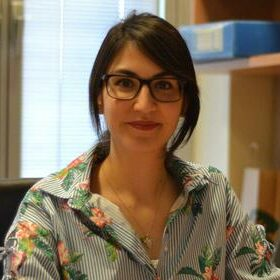
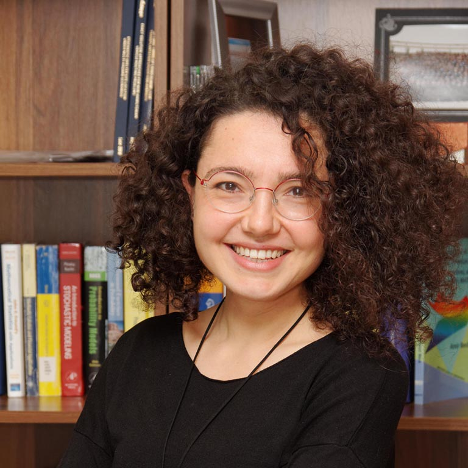
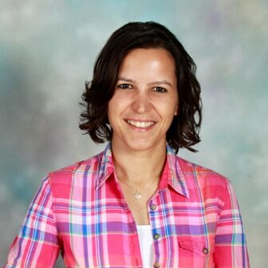
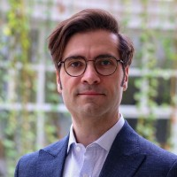
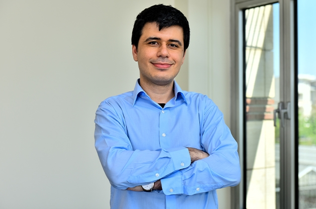
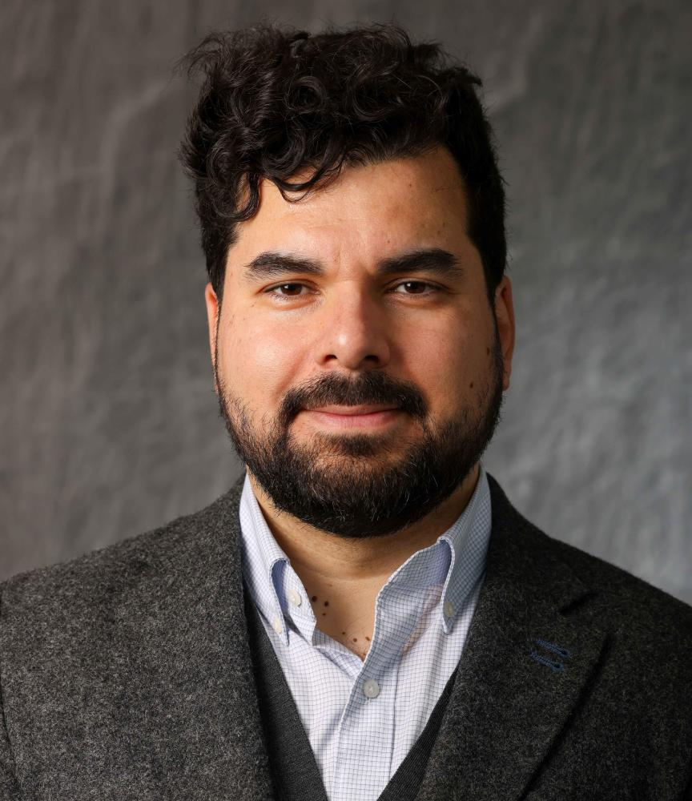
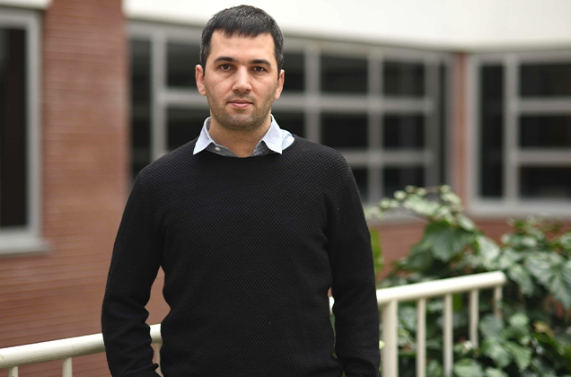
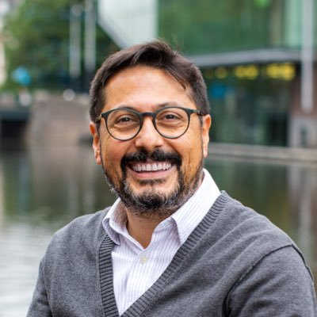

We are an interdisciplinary team of researchers from around the globe collaborating on various projects.

## Director

::: {.person}
{width=180px}

### Dr. Amine Gizem Özbaygın
**Assistant Professor**
Department of Industrial Engineering, Bilkent University

Gizem's research focuses on modeling and solving large-scale optimization problems, mostly with applications in transportation and logistics. Her recent work explores using quantum computing and physics-inspired methods to tackle complex challenges.
:::

---

## Affiliated Faculty

::: {.person}
{width=160px}

### Dr. Firdevs Ulus
**Associate Professor**
Department of Industrial Engineering, Bilkent University

Firdevs' research focuses on multi-objective and vector optimization, particularly on designing and analyzing algorithms for linear, convex, nonconvex, and combinatorial vector optimization problems.
:::

::: {.person}
{width=160px}

### Dr. Özlem Çavuş
**Associate Professor**
Department of Industrial Engineering, Bilkent University

Özlem's research interests are in stochastic optimization, risk-averse optimization, Markov decision processes, and medical decision making.
:::

::: {.person}
{width=160px}

### Dr. Cihan Okay
**Assistant Professor**
Department of Mathematics, Bilkent University

Cihan's research is on the mathematics of quantum computing specializing in applications of methods from algebraic topology, representation theory, and polyhedral combinatorics to quantum foundations and computing. 
:::

::: {.person}
{width=160px}

### Dr. Burak Kocuk
**Associate Professor**
Engineering and Natural Sciences, Sabancı University

Burak’s research focuses on developing global optimization methods for mixed-integer nonlinear programming problems arising in engineering optimization and stochastic optimization.
:::

::: {.person}
{width=160px}

### Dr. Diego Moran Ramirez
**Assistant Professor**
Industrial and Systems Engineering, Rensselaer Polytechnic Institute

Diego's research focuses on the theory of mixed integer programming, cutting planes, and duality.
:::

::: {.person}
{width=160px}

### Dr. Sinan Yıldırım
**Assistant Professor**
Engineering and Natural Sciences, Sabancı University

Sinan’s research focuses on Bayesian statistics, Monte Carlo methods, and data privacy in machine learning.
:::

::: {.person}
{width=160px}

### Dr. İlker Birbil
**Professor**
Faculty of Economics and Business, University of Amsterdam

Ilker’s research focuses on optimization methods for artificial intelligence and decision making. More recently, he is  interested in explainable and trustworthy optimization.
:::
---

## Research Assistants

* **Ece Kuşdemir (IE - masters)**
* **Hüseyin Beyribey (IE - undergrad)**

---
